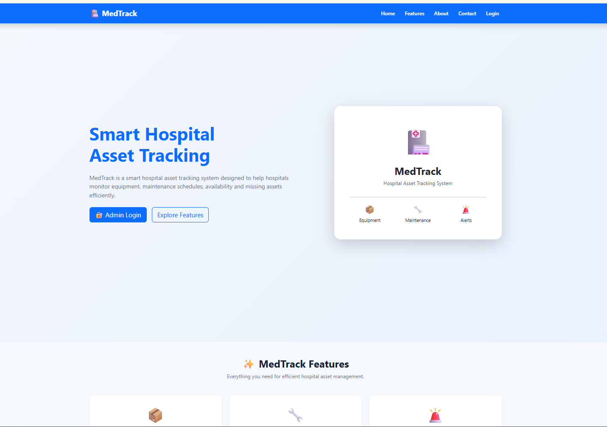
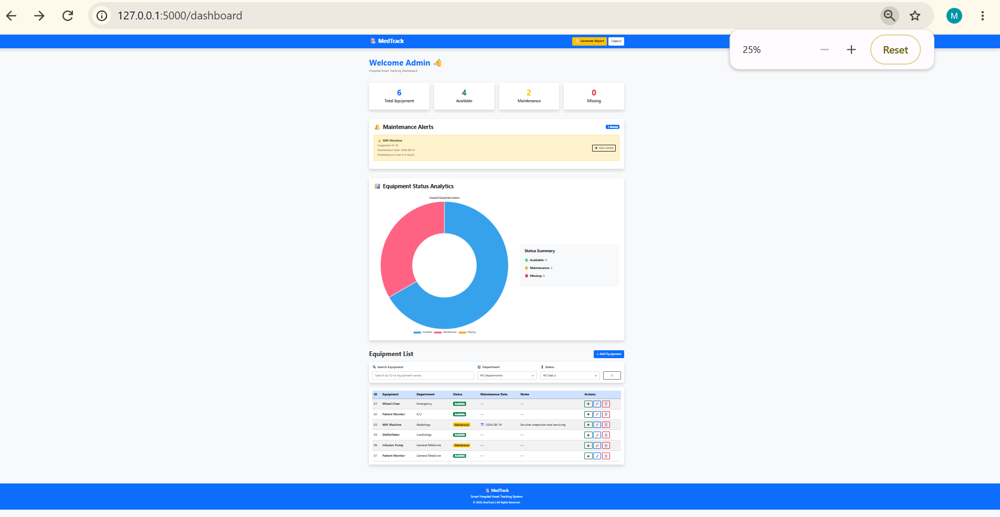
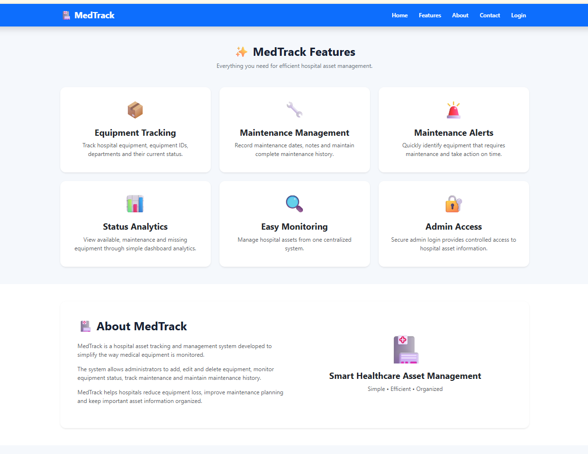
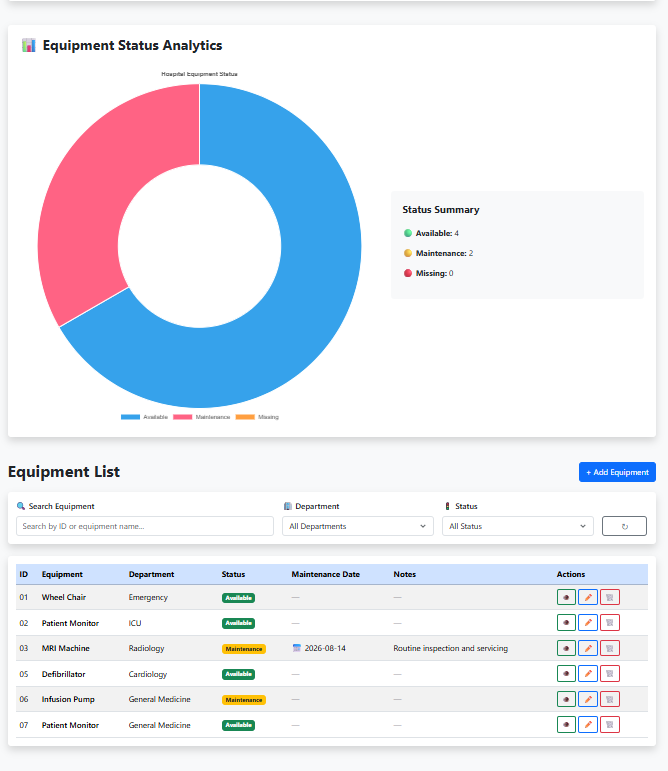
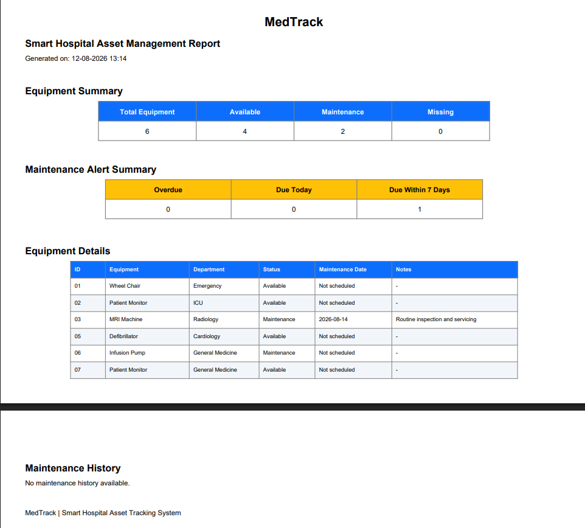

# 🏥 MedTrack – Smart Hospital Asset Management Platform

MedTrack is a web-based Smart Hospital Asset Management Platform designed to help hospitals efficiently track, monitor, and manage medical equipment from a centralized dashboard.

The platform provides equipment status tracking, maintenance alerts, equipment management, analytics, and PDF report generation.

---

## ✨ Key Features

- 📊 **Interactive Dashboard** – View hospital equipment statistics at a glance.
- 🏥 **Department Management** – Filter equipment based on department.
- 🔍 **Equipment Search** – Search equipment by ID or name.
- 🚦 **Status Tracking** – Monitor Available, Maintenance, and Missing equipment.
- 🔔 **Maintenance Alerts** – Identify upcoming and overdue maintenance.
- 🛠️ **Maintenance Records** – Maintain equipment maintenance information.
- 👁️ **Equipment Details** – View detailed equipment information.
- ✏️ **Equipment Management** – Add, edit, view, and delete equipment.
- 📈 **Status Analytics** – Visualize equipment status using charts.
- 📄 **PDF Report Generation** – Generate downloadable equipment reports.
- 🔐 **Admin Login** – Restrict access to the management dashboard.

---

## 🛠️ Technologies Used

| Category | Technologies |
|---|---|
| Frontend | HTML, CSS, Bootstrap, JavaScript |
| Backend | Python, Flask |
| Database | SQLite |
| Charts | Chart.js |
| PDF Generation | ReportLab |
| Development | Visual Studio Code |

## 📸 Screenshots

### 🏠 Home Page



---

### 📊 Dashboard



---

### ✨ Features



---

### 🏥 Equipment Management



---

### 📄 Report Generation



The MedTrack dashboard provides a centralized view of hospital equipment and includes:

- Total equipment count
- Available equipment
- Equipment under maintenance
- Missing equipment
- Maintenance alerts
- Equipment status analytics
- Equipment search
- Department filtering
- Equipment management actions

---

## 🔔 Maintenance Management

MedTrack helps administrators monitor equipment maintenance schedules.

Administrators can:

- Add maintenance information
- View maintenance records
- Track maintenance dates
- Identify upcoming maintenance
- Monitor equipment requiring attention

---

## 📄 PDF Report Generation

MedTrack includes a PDF report generation feature that allows administrators to generate downloadable hospital equipment reports.

The generated report can include:

- Equipment summary
- Equipment status
- Available equipment
- Equipment under maintenance
- Missing equipment
- Maintenance information
- Equipment details

---

## 🏥 Equipment Management

Administrators can manage hospital equipment through the platform.

### Available operations

- ➕ Add equipment
- 👁️ View equipment
- ✏️ Edit equipment
- 🗑️ Delete equipment
- 🔍 Search equipment
- 🏥 Filter by department
- 🚦 Filter by equipment status

---

## 🔐 Admin Login

MedTrack provides an administrator login interface for accessing the hospital asset management dashboard.

---

## 📂 Project Structure

```text
Medtrack/
│
├── app.py
├── requirements.txt
├── README.md
├── .gitignore
│
├── screenshots/
│   ├── home.png
│   ├── dashboard.png
│   ├── features.png
│   └── Equipments.png
│
├── static/
│   ├── css/
│   │   └── style.css
│   ├── js/
│   │   └── script.js
│   └── images/
│       └── hospital.jpg
│
└── templates/
    ├── index.html
    ├── login.html
    ├── dashboard.html
    ├── equipment.html
    ├── edit_equipment.html
    ├── equipment_details.html
    ├── contact.html
    └── report.html